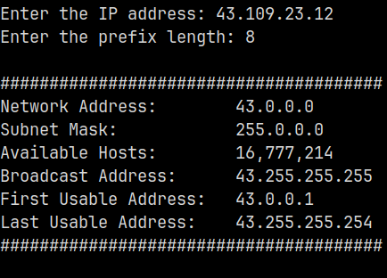

# Python Projects

1. Tic-tac-toe. Download the [file](./tic-tac-toe.py) and run it with:

   ```
   py tic-tac-toe.py
   ```

   Follow the prompts and you'll figure out how to play (:  
   

1. [A small program](./requirements_sorter.py) to help you find a job.
   You enter job requirements from different job descriptions, the program
   reads them and figures out which ones are more popular than others. When
   you're done, you get the final list of requirements sorted by popularity and
   a file with the same list.

1. [An IPv4 converter program](./ip_converter.py) to help you easily determine
   the network address, broadcast address, first and last usable addresses, and
   subnet mask based on an IP address and prefix length. For example, with an
   IP address of **43.109.23.12 / 8**:

   
